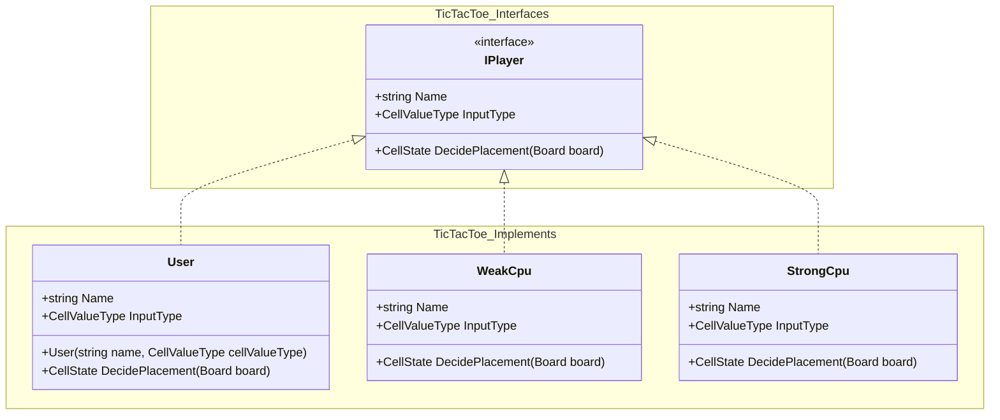
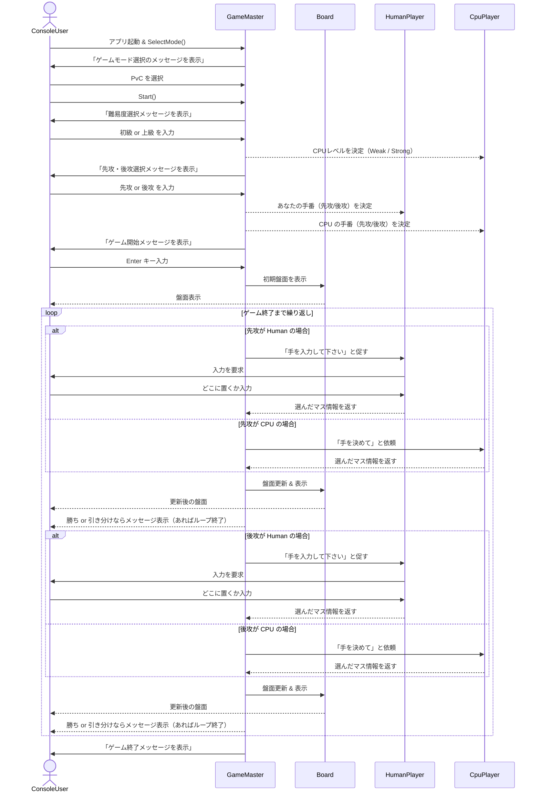
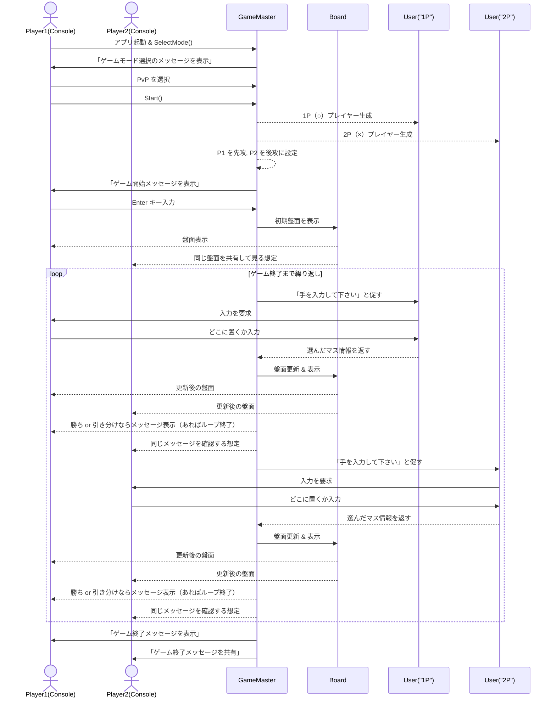

# クラス構成

 

- IPlayer 
  ゲームプレイヤー・CPU 両者が持つ共通の振る舞いをインターフェースとして定義 

- User 
  ゲームプレイヤーの振る舞いを実装 

- WeakPlayer 
  空いているマスを埋めるだけの弱めの CPU の振る舞いを実装 

- StrongPlayer 
  真ん中、四隅、リーチのマスを優先的に埋める強めの CPU の振る舞いを実装 

# シーケンス

**PvC の場合**

 

**PvP の場合**

